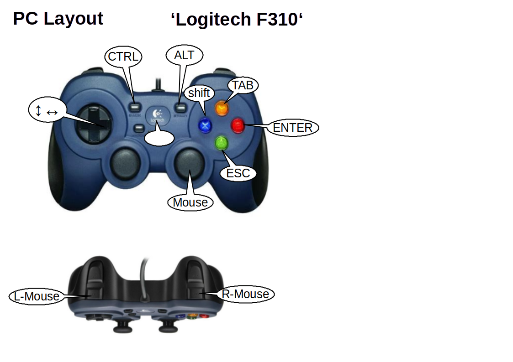

### jstest ### 

( App to jest joysticks)

INSTALL jstest:

sudo apt-get install jstest-gtk

### onboard ###

( App to use on screen keyboard )


INSTALL onboard:

sudo apt-get install onboard

### QJoypad ###

(App to map joystick buttons as mouse )

INSTALL QJoypad:

sudo apt-get update -y

sudo apt-get install -y qjoypad

---------------------------------------------------
Layout directory:

  /home/pi/.qjoypad3/

Autostart directory:

/etc/xdg/lxsession/LXDE-pi

Autostart file:

autostart
```

qjoypad

```
If can not access qjoypad GUI because icon in tray is not visible:

killall qjoypad

then restart qjoypad.

---------------------------------------------------





